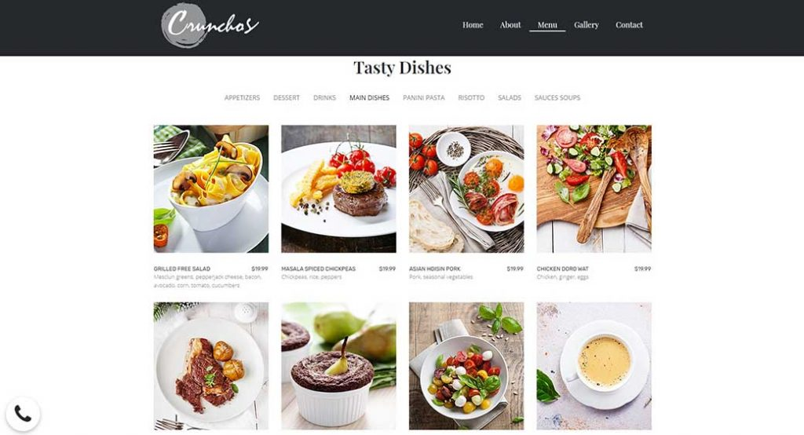

# 🍽️ Restaurant Website - WordPress Project

A fully responsive and visually appealing restaurant website built using WordPress. This project is ideal for restaurants, cafés, or food outlets looking to showcase their menu, gallery, and services online.
---
## 🚀 Features

- Beautiful homepage with featured dishes
- About Us and Contact pages
- Integrated gallery section
- Menu listing with images and prices
- Contact form using plugin
- SEO-optimized with Yoast SEO plugin
- Mobile responsive design

---
## 🧩 Technologies Used

- WordPress (Elementor + Theme customization)
- PHP, HTML5, CSS3
- MySQL (via WordPress)
- Plugins: Contact Form 7, Yoast SEO, WPForms

---

## 📸 Screenshots

<h3>📋 Menu Page</h3>

---

<h3>✉️ Contact Page</h3>

## 🔧 Installation & Setup

1. Clone or download the ZIP of this repo.
2. Install XAMPP / LocalWP or use any local server.
3. Import the WordPress project into `/htdocs` or LocalWP.
4. Create a new database and import the SQL file (if provided).
5. Open `localhost/restaurant-site` or your local domain.
6. Customize via WordPress dashboard.

---

## 📁 Folder Structure

restaurant-website-wordpress/
├── wp-content/
│ ├── themes/
│ └── plugins/
├── wp-config.php
└── ...
---

## 📌 Tags

`#wordpress` `#restaurant` `#webdesign` `#php` `#responsive` `#elementor`

---

## 📣 Author

**Prithi Babu**  
GitHub: [@prithi2004](https://github.com/prithi2004)

---
